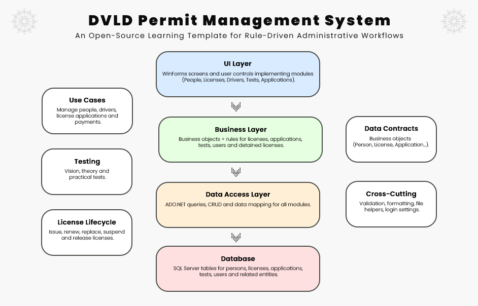

---

# 🚦 Permit — Driver Licensing Management System (Graduation Project)

**Permit is a Driver Licensing Management System, developed as a graduation project after an intensive 1.5‑year practical training program completed online. The journey started from programming fundamentals and evolved toward building rule‑based, state‑driven systems.**

---

## 🗂 What Permit Actually Provides

### **Core Rule-Based Modules**

- **User Management** — permissions & activation
- **License Lifecycle** — issue, renew, replace, suspend
- **Applications** — requests, fees, processing
- **Exams** — scheduling & recording
- **International Licenses** — eligibility rules
- **Detained Licenses** — violations & release

**Each module contains logic, not just database operations.**

---

## 🏗 Why N-Tier Architecture?

To show learners where rules truly belong:

- **DAL** → data access only
- **BLL** → rules, workflows, validations
- **UI** → triggers operations and displays state

This separation makes logic easier to understand, reuse, and extend.

---

## 🖥 Why Windows Forms?

Because the goal is to focus on **business logic**, not frontend complexity.

WinForms offers:

- Instant UI
- Zero complexity
- Fast prototyping
- Direct interaction with the logic

This keeps the learner focused on **rules and states** instead of UI styling.

---

## 🔧 What You Can Learn as a Student or New Developer

- Structuring rule‑based logic
- Managing state transitions
- Validating operations with conditions
- Building workflow‑oriented modules
- Separating UI, logic, and data properly
- Understanding real administrative patterns

---

## 📁 Database Schema

---

## 🧩 Technologies

- .NET Framework (C#)
- Windows Forms
- Guna2 Framework
- ADO.NET
- SQL Server
- N‑Tier Architecture

---

## 📸 Screenshots

  
  
  
  

---

### 🙌 Closing Thoughts

**Permit** began as a small personal experiment and evolved into a compact **educational template** for understanding **rule-based systems**.

If it **inspires** you or helps you **learn**, that's already more than enough.

Feel free to **fork** it, **extend** it, or use it in your own learning journey — that's the spirit of **open source**.
