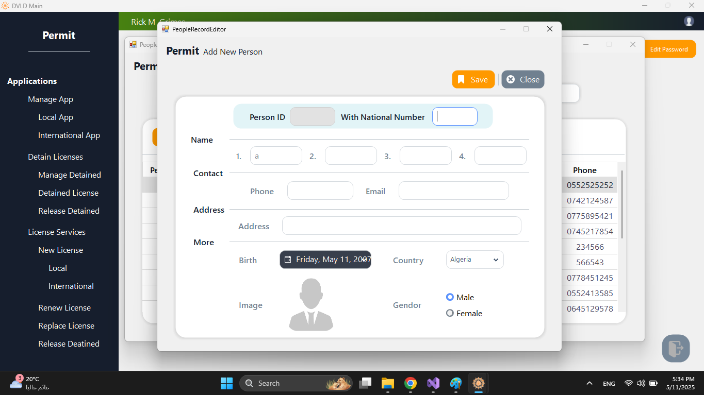
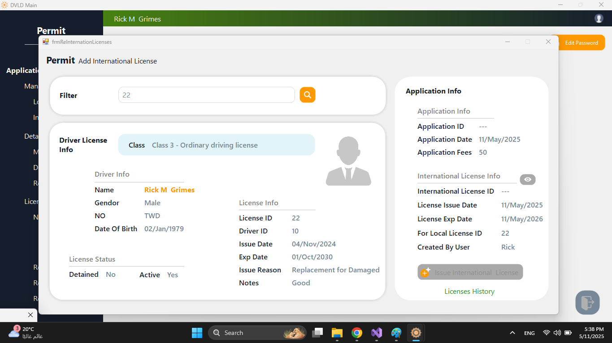

Permit Management System

Multi-layered WinForms desktop application for managing national and international driving license operations, built with a clear N-tier architecture using SQL Server for data persistence and Guna UI Framework for an enhanced user interface.

🛠️ Note: This project was developed and completed in 2024.

💡 Overview

The system simulates a real-world government platform for issuing, renewing, and managing driving licenses. It follows a service-oriented architecture and covers complex business logic for various license operations.

Developed as part of the DVLD Project (Driving & Vehicle License Department), based on detailed official specifications.

🏗️ Key Features

N-tier architecture: Separation of concerns (UI, BLL, DAL)

Advanced entity model: 15+ relational tables (see ER diagram)

User management: Create, update, freeze, and manage access

License lifecycle: Issue, renew, replace (lost/damaged), and suspend licenses

Application management: Track requests, payments, and statuses

Test tracking: Manage appointments and record results for vision, theory, and practical exams

International licenses: Issue and validate based on national eligibility

Detained licenses: Fine tracking, release workflows, and historical logs

Fully functional UI using Guna framework

📦 Technologies

Language: C# (.NET Framework)

UI: WinForms + Guna UI2

Database: Microsoft SQL Server

Architecture: N-tier (UI – BLL – DAL)

📷 Screenshots

  
  
  
  
  
  

📁 Database Schema
  
  

🚧 Future Enhancements

Add reporting capabilities

Export/import licenses

Role-based access control (RBAC)

Web version (ASP.NET Core)